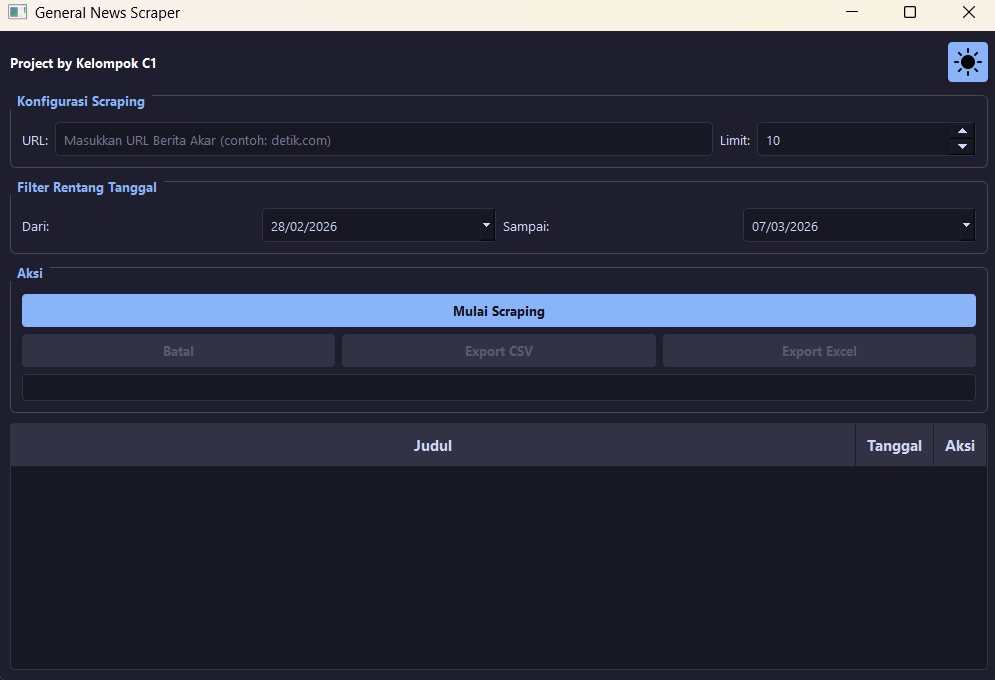

# General News Scraper

General News Scraper adalah aplikasi desktop berbasis Python yang digunakan untuk mengambil (scraping) data berita dari sebuah situs berita secara otomatis. Aplikasi ini menyediakan antarmuka grafis (GUI) yang memudahkan pengguna untuk mengambil artikel berita, memfilter berdasarkan tanggal, serta mengekspor hasil scraping ke dalam format CSV atau Excel.

Aplikasi ini dibuat menggunakan library **PyQt5** untuk antarmuka, serta **Selenium WebDriver** untuk melakukan scraping halaman web secara otomatis.

---

# Fitur Utama

1. Scraping berita dari situs berita tertentu
2. Filter berita berdasarkan rentang tanggal
3. Menentukan jumlah berita yang ingin diambil
4. Progress bar untuk melihat proses scraping
5. Melihat isi konten berita langsung di aplikasi
6. Membuka artikel asli di browser
7. Export data ke:
  - CSV
  - Excel (.xlsx)
8. Tema tampilan:
  - Dark Mode
  - Light Mode

---

# Teknologi yang Digunakan

- Python
- PyQt5 (GUI Framework)
- Selenium (Web Automation)
- WebDriver Manager
- Dateparser
- Openpyxl (Export Excel)

---

# Cara Instalasi

Pastikan Python sudah terinstall di komputer.

### 1. Clone Repository

```bash
```
git clone https://github.com/SulLightAnony/1C-D4_PBL_Kelompok_1.git 
---
### 2. Masuk ke folder project
cd nama-repository

### 3. Install dependencies
pip install PyQt5 selenium webdriver-manager dateparser openpyxl

# Cara menjalankan aplikasi
```bash
### 1. Jalankan file
run python main.py

### 2. Masukkan url website berita pada kolom URL
contoh : detik.com, kompas.com, dsb

### 3. Tentukan jumlah berita yang ingin diambil

### 4. Tentukan rentang tanggal berita menggunakan filter tanggal

### 5. Klik tombol "Mulai Scraping"

### 6. Tunggu hingga proses scraping selesai

### 7. Hasil akan muncul pada tabel yang berisi :
- judul berita
- tanggal
- tombol aksi

### 8. Pengguna dapat
- Klik Lihat Konten untuk membaca isi berita

- Klik Buka URL untuk membuka berita di browser

### 9. Setelah scraping selesai, data dapat disimpan menggunakan:
- Export CSV

- Export Excel

# Struktur Project
project-folder
│
├── main.py        # Entry point aplikasi
├── gui.py         # Antarmuka aplikasi (GUI)
├── scraper.py     # Proses scraping menggunakan Selenium
├── theme.py       # Tema tampilan dark & light
└── README.md

--- 
# Preview Tampilan

### Tampilan Utama


### Proses Scraping


### Hasil Scraping


---

# Author 
Project ini dibuat oleh Kelompok C1 
---
#Lisensi
Project ini dibuat untuk keperluan pembelajaran dan tugas akademik.