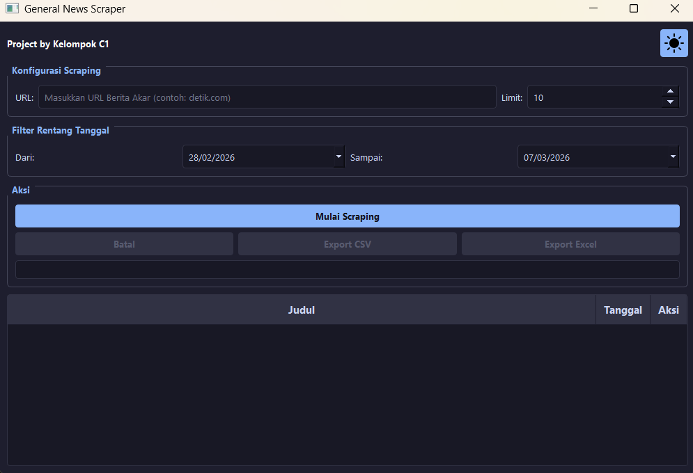

# General News Scraper

**General News Scraper** adalah aplikasi desktop berbasis Python untuk melakukan scraping berita secara otomatis dari situs berita.

Aplikasi ini menyediakan GUI yang memudahkan pengguna untuk:

* Mengambil artikel berita
* Memfilter berdasarkan tanggal
* Mengekspor hasil ke CSV atau Excel

---

## Fitur Utama

* 🔍 Scraping berita otomatis
* 📅 Filter berdasarkan tanggal
* 🔢 Menentukan jumlah berita
* 📊 Progress bar proses
* 📖 Lihat isi berita langsung
* 🌐 Buka artikel di browser
* 💾 Export ke:

  * CSV
  * Excel (.xlsx)
* 🎨 Dark Mode & Light Mode

---

## Teknologi

* Python
* PyQt5
* Selenium
* WebDriver Manager
* Dateparser
* Openpyxl

---

## Instalasi

### 1. Clone Repo

```bash
git clone https://github.com/SulLightAnony/1C-D4_PBL_Kelompok_1.git
cd 1C-D4_PBL_Kelompok_1/Tugas_03_GeneralWebScr...
```

### 2. Install Dependency

```bash
pip install PyQt5 selenium webdriver-manager dateparser openpyxl
```

### 3. Jalankan

```bash
python main.py
```

---

## Cara Pakai

1. Masukkan URL website (contoh: detik.com)
2. Tentukan jumlah berita
3. Pilih rentang tanggal
4. Klik **Mulai Scraping**
5. Lihat hasil / buka di browser
6. Export ke CSV atau Excel

---

## Struktur Proyek

| File         | Deskripsi            |
| ------------ | -------------------- |
| `main.py`    | Entry point aplikasi |
| `gui.py`     | Tampilan GUI         |
| `scraper.py` | Engine scraping      |
| `theme.py`   | Styling tema         |
| `Icons/`     | Asset gambar         |

---

## Preview Tampilan

<p align="center">
  
</p>

---

## Kontributor

**Kelompok C1 - D4 Teknik Informatika**

---

## Catatan

Project ini dibuat untuk keperluan pembelajaran (PBL).
Gunakan dengan bijak dan sesuai aturan website terkait.